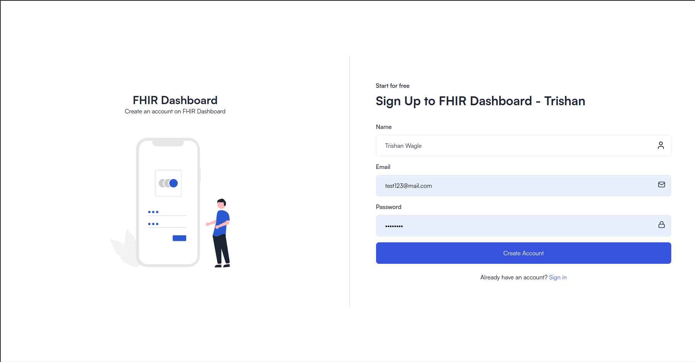

# FHIR Visualization

This project is a full-stack web application for visualizing US Healthcare Sector data using the FHIR Standard. It is created with an Express.js backend, MySQL Database, and a Next.js frontend. It uses D3.js for data visualization,
Tailwind CSS for styling, ShadcnUI as UI Component Library and other modern tools and libraries to provide a rich user experience.

## Authors

- [@trishan9](https://github.com/trishan9)
- [@stsh59](https://github.com/stsh59)

## Project Structure

- `backend`: The Express.js server application.
- `frontend`: The Next.js client application.

## Getting Started

Follow these steps to set up and run the project locally.

### Setting Up the Backend

1. Navigate to the backend directory:
   `cd backend`
2. Install the necessary dependencies:
   `npm/pnpm/yarn/bun install`
3. Start the server:
   - `npm/pnpm/yarn/bun run dev` (For Development Purpose)
   - `npm/pnpm/yarn/bun start` (For Production Environment)

### Setting Up the database via Workbench

1. Create a database named `visualisation` in your localhost from your SQL Workbench.

```sql
CREATE DATABASE visualisation
```

2. Importing the FHIR sample data sql dump file to `visualisation` schema that we created earlier. 

- Extract the data zip file from `data/sample_data.zip` ->  In SQL Workbench : Go to Administration -> Data Import/Restore -> Import from self-contained file -> Select the dump file from your device i.e. `data/sample_data.sql` -> Select default target schema to `visualisation` -> Start Import

3. Create users table in your database to persist the data of users (for auth).

```sql
CREATE TABLE visualisation.`users` (
  `Id` varchar(50)  NOT NULL,
  `Name` varchar(50) DEFAULT NULL,
  `Email` varchar(50) DEFAULT NULL,
  `Password` varchar(500) DEFAULT NULL,
  PRIMARY KEY (`Id`),
  UNIQUE KEY `Id` (`Id`)
) ENGINE=InnoDB AUTO_INCREMENT=795 DEFAULT CHARSET=utf8mb4 COLLATE=utf8mb4_0900_ai_ci
```

### Setting Up the Frontend

1. Navigate to the frontend directory:
   `cd ../frontend`
2. Install the necessary dependencies:
   `npm/pnpm/yarn/bun install`
3. Start the server:
   - `npm/pnpm/yarn/bun run dev` (For Development Purpose)
   - `npm/pnpm/yarn/bun start` (For Production Environment)

### Setup completed

Now you can access the frontend application at `http://localhost:3000` and the backend will be serving at the designated port
(by default: `http://localhost:3001/api` or depending on the setup).

## Screenshots

### Auth Screens




### Data Visualisation Dashboard


### Tables


### Database
